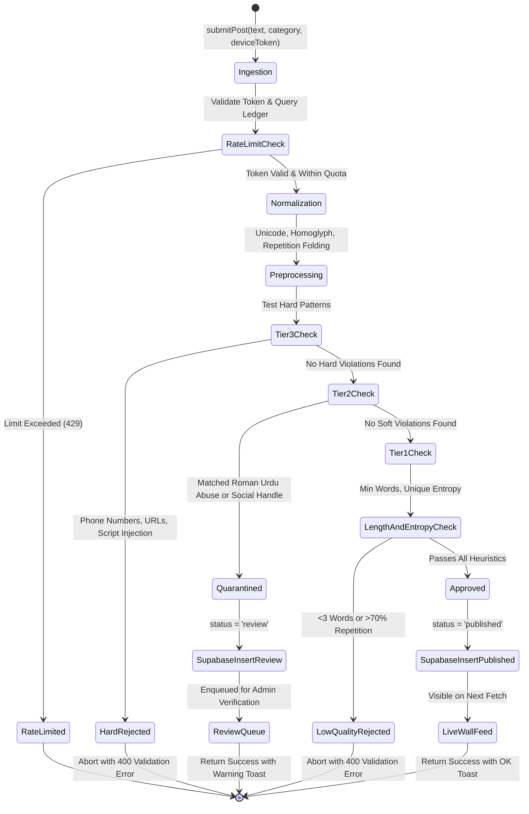

# Phase 5 — Server-Side Spam Defense, Cultural Text Normalization & Multi-Tier Moderation Engine
*Exhaustive Master Implementation Plan for Senior Engineering Execution*

---

> [!IMPORTANT]
> **Prerequisite Gate:** Phase 4 ([09_phase4_real_data_wiring.md](file:///c:/Users/mughe/OneDrive/Desktop/Personal%20projects/thought-wellspring/plans/09_phase4_real_data_wiring.md)) must be fully deployed, verified, and active in the codebase before implementing Phase 5.
> All client routes (Wall, Duel, Read) are now communicating with live Supabase database procedures via TanStack Start edge RPCs.
> Phase 5 focuses on **platform safety, cultural integrity, and abuse prevention**: transforming the rudimentary spam filter into an industrial-strength, three-tier automated and human-in-the-loop moderation pipeline capable of protecting a high-velocity pseudonymous community.

> [!NOTE]
> **Specification Standard:** This document contains **zero boilerplate or generic pseudocode**. It details exact type definitions, multi-stage normalization algorithms, culturally specific regex matrices for Pakistani mobile and Roman Urdu formats, atomic PostgreSQL stored procedures, rate-limiting ledger schemas, and comprehensive end-to-end verification suites.

---

## Part 0: Executive Architecture & Threat Modeling

### 0-A: Threat Model for Pseudonymous Confession Platforms

Pseudonymous platforms in South Asia—specifically targeted at young adult Pakistani demographics—face five distinct vectors of adversarial and malicious activity:

```
                              ┌─────────────────────────────────────────────────────────┐
                              │            ADVERSARIAL ATTACK VECTORS                   │
                              └─────────────────────────────────────────────────────────┘
                                   │               │               │               │
      ┌────────────────────────────┴─┐             │               │             ┌─┴────────────────────────────┐
      ▼                              ▼             │               ▼             ▼                              ▼
┌───────────────┐            ┌───────────────┐     │     ┌─────────────────┐ ┌───────────────┐          ┌───────────────┐
│ Doxxing & PII │            │ Social Shills │     │     │ Cultural Abuse  │ │ Bot Flooding  │          │ Bad-Faith     │
│ Phone Numbers │            │ & Scam Links  │     │     │ & Hate Speech   │ │ & Script Spam │          │ Mass-Vetoes   │
└───────────────┘            └───────────────┘     │     └─────────────────┘ └───────────────┘          └───────────────┘
      │                              │             │               │                 │                          │
      ▼                              ▼             ▼               ▼                 ▼                          ▼
┌───────────────────────────────────────────────────────────────────────────────────────────────────────────────────────┐
│                                    BAJIHEARS MULTI-TIER DEFENSE PIPELINE                                              │
├─────────────────────────────────────────┬─────────────────────────────────┬───────────────────────────────────────────┤
│ Tier 3: Hard Auto-Reject (API Boundary) │ Tier 2: Auto-Quarantine (Review)│ Tier 1: Auto-Approve (Wall Feed)          │
│ • Phone numbers (+92, 03xx, words)      │ • Roman Urdu abusive lexicons   │ • Clean text, authentic emotion           │
│ • URLs, links, Discord/WhatsApp invites │ • Ambiguous handles/promotions  │ • Passes all normalization checks         │
│ • Script injections / XSS vectors       │ • Flagged by ≥5 community vetoes│ • Atomic insertion with status='published'│
└─────────────────────────────────────────┴─────────────────────────────────┴───────────────────────────────────────────┘
```

1. **Doxxing and Malicious Contact Sharing (Tier 3 Critical Risk):**
   - Submitting phone numbers of non-consenting individuals (ex-partners, classmates) accompanied by derogatory remarks.
   - Attackers disguise numbers using transliteration (`zero teen zero zero...`), spaced digits (`0 3 0 0 - 1 2 3`), homoglyphs (`O3OO`), or Urdu word representations.
2. **Commercial Shilling & Off-Platform Social Funneling (Tier 2/3 Risk):**
   - Directing users to Instagram handles, Snapchat, TikTok, WhatsApp groups (`wa.me`), or Telegram channels.
   - Promotion of illicit gambling (1xBet, MelBet), crypto schemes, or paid services.
3. **Severe Cultural Abuse, Slurs, and Harassment (Tier 2 Risk):**
   - Targeted harassment using Roman Urdu profanities, regional slurs, sectarian terms, or threatening rhetoric that standard English profanity filters fail to identify.
4. **Automated Flooding and Burst Injection (Rate Limiting Risk):**
   - Scripted bots rotating pseudonymous `device_token` values or firing parallel HTTP requests to overwhelm the feed and displace genuine content.
5. **Brigading and Bad-Faith Censorship (Veto Abuse Risk):**
   - Coordinated groups mass-reporting benign confessions from authors they dislike to trigger auto-quarantine thresholds.

---

### 0-B: Three-Tier Content Disposition State Machine

Every submission entering `submitPost` or `addEcho` traverses a deterministic, multi-stage state machine:



---

### 0-C: Subsystem State Transition Matrix

| Subsystem | State Before Phase 5 | Target Production State (After Phase 5) |
|---|---|---|
| **Spam Filter Architecture** | Single regex array in `spam-filter.ts` checking only 10 basic patterns. Binary pass/fail. | 3-stage normalization pipeline + two-tiered regex dictionaries (Hard Block vs Soft Review) with cultural Pakistani adaptations. |
| **Pakistani Phone Detection** | Only catches continuous `03\d{9}` and `+92\d{10}`. Bypassed by spaces, dashes, or words. | Detects all domestic prefixes (`0300`–`0349`), international formats, spaced-out digits, and phonetic words (`zero teen`, `o three`). |
| **Roman Urdu Abuse Detection** | Non-existent. Relies purely on English keywords. | Comprehensive Roman Urdu swear word, slur, and harassment lexicon with phonetic root matching. |
| **Rate Limiting Engine** | In-memory config reading from `unsaids` directly. Report rate limit incorrectly queries post table. | Unified `device_actions` ledger in Supabase tracking rolling windows for posts, echoes, reactions, and reports independently. |
| **Community Veto Engine** | Simple update query prone to race conditions. Auto-hides at 5 reports without engagement checks. | Atomic SQL stored procedure (`append_veto_atomic`) with self-report guards, 5-report auto-quarantine, and engagement shields. |
| **Moderation Interface** | Manual table inspection in Supabase with no audit trail. | Optimized `moderation_queue` SQL view with calculated risk scores and an immutable `moderation_audit_log` table. |

---

## Part 1: Text Preprocessing & Canonical Normalization Pipeline

A core failure mode of naive regex filters is that attackers trivially defeat them via **obfuscation**: inserting zero-width spaces, replacing Latin characters with Cyrillic homoglyphs, or repeating characters (`0 3 0 0` or `f.u.c.k`).

The server must execute a strict, 4-stage normalization pipeline **prior to running any pattern matching**:

```
Raw User Input: "Cаll  me  at  0 3 0 0 - 1 2 3 4 5 6 7  plzzzz!!"
      │
      ▼ [Stage 1: Zero-Width & Unicode Normalization (NFKD)]
Cleaned Unicode: "Call  me  at  0 3 0 0 - 1 2 3 4 5 6 7  plzzzz!!"
      │
      ▼ [Stage 2: Homoglyph & Leetspeak Canonicalization]
Normalized Latin: "Call  me  at  0 3 0 0 - 1 2 3 4 5 6 7  plzzzz!!"
      │
      ▼ [Stage 3: Character Repetition Folding]
Folded Repeats: "Call me at 0 3 0 0 - 1 2 3 4 5 6 7 plzz!!"
      │
      ▼ [Stage 4: Compact Form Generation]
Spaceless Variant: "callmeat03001234567plzz!!"  <── Tested against contact patterns
Normalized Variant: "call me at 03001234567 plzz!!" <── Tested against language patterns
```

### 1-A: Zero-Width Characters & Unicode Normalization

**Target File:** `src/server/lib/moderation/normalize.ts`

Attackers insert invisible characters between letters to break regular expressions (e.g. `p\u200Bo\u200Br\u200Bn`).

```typescript
export interface NormalizedTextPayload {
  original: string;
  normalized: string;        // Folded case, trimmed, normalized whitespace
  compact: string;           // Punctuation and spaces stripped for sequence detection
  words: string[];           // Tokenized array of lower-case words
}
```

The normalization function must:
1. Apply Unicode Normalization Form KD (`str.normalize('NFKD')`) to separate base characters from combining diacritical marks.
2. Strip all zero-width characters:
   - `\u200B` (Zero-width space)
   - `\u200C` (Zero-width non-joiner)
   - `\u200D` (Zero-width joiner)
   - `\uFEFF` (Zero-width no-break space / BOM)
   - `\u200E` & `\u200F` (Left-to-right and right-to-left marks)
   - `\u0300`–`\u036F` (Combining diacritical marks)
3. Convert all non-standard whitespace characters (`\u00A0`, `\u2000`–`\u200A`, `\u202F`, `\u205F`, `\u3000`) into standard ASCII space (`\u0020`).

---

### 1-B: Homoglyph & Leetspeak Canonicalization Matrix

Malicious actors substitute visually identical glyphs from Cyrillic, Greek, or symbol tables (e.g., Cyrillic small letter `а` `\u0430` for Latin `a` `\u0061`).

The pipeline must map homoglyphs to their ASCII equivalents using a deterministic translation dictionary:

| Source Character / Homoglyph | Canonical Target | Category |
|---|---|---|
| `а`, `α`, `à`, `á`, `â`, `ã`, `ä`, `@`, `4` | `a` | Vowel substitution |
| `е`, `ё`, `ε`, `é`, `è`, `ê`, `ë`, `3`, `€` | `e` | Vowel substitution |
| `і`, `ї`, `ι`, `í`, `ì`, `î`, `ï`, `1`, `!`, `\|` | `i` | Vowel substitution |
| `о`, `ο`, `ò`, `ó`, `ô`, `õ`, `ö`, `0`, `θ` | `o` | Vowel substitution |
| `и`, `υ`, `ú`, `ù`, `û`, `ü`, `μ` | `u` | Vowel substitution |
| `с`, `ç`, `¢`, `$` | `s` | Consonant substitution |
| `р`, `ρ` | `p` | Consonant substitution |
| `х`, `χ`, `×` | `x` | Consonant substitution |
| `у` | `y` | Consonant substitution |
| `в` | `b` | Consonant substitution |
| `т`, `7`, `+` | `t` | Consonant substitution |

---

### 1-C: Repetition Folding & Whitespace Compression

1. **Repetition Folding:** Collapse any character repeated 3 or more times down to 2 occurrences:
   - Example: `"noooooooo"` $\rightarrow$ `"noo"`
   - Example: `"whyyyyyyy"` $\rightarrow$ `"whyy"`
   - Example: `"0 3 0 0 0 0 0 0 0 0 0"` $\rightarrow$ `"0300"` (in compact representation)
   - *Rationale:* Preserves natural emotional emphasis (like `"so cool"`) while eliminating regex bypasses and visual flooding.
2. **Whitespace Compression:** Collapse all consecutive spaces, tabs, and carriage returns into a single space, followed by `.trim()`.

---

### 1-D: Dual-Payload Inspection Architecture

The normalization engine produces **two distinct representations** of the confession for evaluation:

1. **`normalizedText`:** Retains single spaces and punctuation. Used for semantic checks, minimum word counts, repetition ratios, and dictionary lookups.
2. **`compactText`:** Strips all spaces, hyphens, periods, brackets, and non-alphanumeric characters, converted entirely to lowercase. Used specifically for anti-doxxing, phone numbers, and URL regex scans.

---

## Part 2: Hard Security & Anti-Doxxing Engine (Tier 3: Auto-Reject)

**Target File:** `src/server/lib/moderation/hard-filters.ts`

Any submission matching Tier 3 rules is **immediately aborted at the API boundary**. It is neither published nor sent to the review queue. The server returns HTTP 400 with `error.code = 'CONTENT_VIOLATION'`.

```typescript
export interface HardFilterResult {
  blocked: boolean;
  violationType?: 'PHONE_NUMBER' | 'URL_LINK' | 'SCRIPT_INJECTION' | 'SEVERE_EXPLOIT';
  details?: string;
}
```

### 2-A: Pakistani & International Phone Number Detection Suite

Pakistani mobile numbers follow strict allocation blocks under the Pakistan Telecommunication Authority (PTA):
- Country Code: `+92` or `0092`
- National Destination Code (NDC): `300` through `349` (covering Jazz, Zong, Telenor, Ufone, SCO)
- Subscriber Number: 7 digits
- Total domestic format: 11 digits starting with `03xx` (e.g., `03001234567`)

#### Comprehensive Regex Specifications:

1. **Standard & Delimited Formats (Tested against `normalizedText`):**
   ```regex
   /(?:(?:\+|00)92[\s.-]?)?0?3[0-4]\d{1}[\s.-]?\d{3}[\s.-]?\d{4}\b/
   ```
2. **Obfuscated Spaced Formats (Tested against `compactText`):**
   ```regex
   /(?:92|0)?3[0-4]\d{8}/
   ```
3. **Phonetic & Word-Spelled Number Detection:**
   Attacking users write numbers phonetically in Roman Urdu or English:
   - Example: *"zero three zero zero one two three four five six seven"*
   - Example: *"o three zero zero..."* or *"zero teen zero zero..."*

   The server must execute a phonetic digit replacement before compacting:
   - Word substitutions: `zero` $\rightarrow$ `0`, `one`/`aik` $\rightarrow$ `1`, `two`/`do` $\rightarrow$ `2`, `three`/`teen` $\rightarrow$ `3`, `four`/`chaar` $\rightarrow$ `4`, `five`/`paanch` $\rightarrow$ `5`, `six`/`chhay` $\rightarrow$ `6`, `seven`/`saat` $\rightarrow$ `7`, `eight`/`aath` $\rightarrow$ `8`, `nine`/`nau` $\rightarrow$ `9`.
   - If the resulting converted digit stream matches a 10- or 11-digit pattern starting with `03` or `923`, it triggers an immediate Tier 3 block.

4. **International Phone Patterns:**
   Detects common overseas diaspora numbers (Middle East, UK, US):
   - UAE: `/(?:\+971|00971)[\s.-]?[5]\d{1}[\s.-]?\d{3}[\s.-]?\d{4}/`
   - Saudi Arabia: `/(?:\+966|00966)[\s.-]?[5]\d{1}[\s.-]?\d{3}[\s.-]?\d{4}/`
   - UK: `/(?:\+44|0044)[\s.-]?[7]\d{3}[\s.-]?\d{6}/`

---

### 2-B: URL, Link & Contact Protocol Neutralization

No external URLs, invitations, or deep links are permitted on the Wall or within Echoes.

1. **Web Protocols & Common TLDs:**
   ```regex
   /\b(?:https?:\/\/|ftp:\/\/|www\.)[a-z0-9-]+(?:\.[a-z0-9-]+)+/i
   ```
2. **Naked Domain Formats with High-Risk TLDs:**
   ```regex
   /\b[a-z0-9-]+\.(?:com|pk|org|net|io|me|xyz|top|online|site|info|app|cc|co)\b/i
   ```
3. **Direct Messaging & Invite Deep Links:**
   - WhatsApp: `/(?:wa\.me|api\.whatsapp\.com|chat\.whatsapp\.com)\/[a-z0-9_-]+/i`
   - Telegram: `/(?:t\.me|telegram\.me)\/[a-z0-9_]+/i`
   - Discord: `/(?:discord\.gg|discord\.com\/invite)\/[a-z0-9_-]+/i`
   - Snapchat Add: `/(?:snapchat\.com\/add)\/[a-z0-9._-]+/i`
   - Instagram Profile: `/(?:instagram\.com|instagr\.am)\/[a-z0-9._-]+/i`
   - TikTok Profile: `/(?:tiktok\.com\/@)[a-z0-9._-]+/i`

---

### 2-C: Code Injection & Markup Stripping

To prevent Stored XSS or HTML injection across the rich rendering surfaces of the Wall:

1. **Disallowed Tags & Syntaxes:**
   - Script, style, iframe, object, embed tags: `/<(?:\/)?(?:script|style|iframe|object|embed|svg|img|link|meta)\b[^>]*>/i`
   - Event handlers: `/\bon\w+\s*=\s*["'][^"']*["']/i` (e.g. `onload=`, `onerror=`)
   - Protocol-based injection: `/(?:javascript|data|vbscript):/i`
2. **Deterministic HTML Entity Encoding:**
   Before persisting any confession text, convert `<`, `>`, `&`, `"`, and `'` to their standard HTML entity representations, preventing HTML rendering in both DOM manipulation and Markdown parsers.

---

## Part 3: Soft Threat & Cultural Moderation Engine (Tier 2: Auto-Review)

**Target File:** `src/server/lib/moderation/soft-filters.ts`

Confessions matching Tier 2 criteria are **quarantined**: inserted into Supabase with `status = 'review'`.
- They are **excluded** from the public wall feed (`WHERE status = 'published'`).
- The author receives a successful submission response with a friendly informational notice: *"Your post has been received and queued for community safety review."*
- The post is surfaced in the moderation queue for administrator approval.

```typescript
export interface SoftFilterResult {
  flagged: boolean;
  category?: 'CULTURAL_ABUSE' | 'SOCIAL_SHILL' | 'LOW_ENTROPY' | 'PROMOTIONAL';
  matchedTerms?: string[];
  severityScore: number; // 1 (Minor concern) to 10 (Critical review)
}
```

### 3-A: Roman Urdu & Cultural Abuse Lexicon

English-only profanity filters fail completely in Pakistan, where confessions are authored primarily in **Roman Urdu** (Urdu transliterated into Latin characters).

The dictionary must categorize terms into weighted severity tiers:

#### 1. Severe Profanity & Vulgarity (Tier 2 Auto-Quarantine, Weight: 8–10):
- Common Roman Urdu curse roots and compound phrases.
- Variations covering typical vowel spelling shifts (e.g., `kutta` / `kuttay` / `kutte`, `kanjar` / `kanjr`, `chootia` / `chutiya` / `chootya`, `harami` / `haraami` / `hramkhor`, `gandu` / `gaandu`, `bhenchod` / `bc` / `bhen k lode`, `madarchod` / `mc`).
- Explicit anatomical and sexual terms transliterated into Roman Urdu.

#### 2. Targeted Harassment, Doxxing Intent & Blackmail (Weight: 9–10):
- Phrases indicating extortion, non-consensual image distribution, or threats:
  - *"pics leak"* / *"video leak"* / *"tasweerain leak"*
  - *"blackmail kar"* / *"barbaad kar doon"*
  - *"address share"* / *"ghar ka pata"*
  - *"num share"* / *"number deta hoon"*

#### 3. Sectarian & Communal Hate Speech (Weight: 10):
- Pejorative religious and sectarian slurs that cause severe societal harm.

---

### 3-B: Off-Platform Social Solicitation & Shilling

Even without direct URL links, users attempt to funnel followers to private social media accounts.

#### Detection Patterns:
1. **Handle Solicitation Flags:**
   ```regex
   /\b(?:insta|ig|snap|sc|telegram|tg|snapchat)\s*(?::|is|-|pe)?\s*@?[a-z0-9._]{3,25}\b/i
   ```
2. **Direct Contact Solicitations:**
   - `"dm me on"` / `"inbox me"` / `"inbox aao"`
   - `"add me on"` / `"follow me on"` / `"baat karni hai to"`
   - `"message karo"` / `"raabta karo"`
3. **Commercial Gambling & Easy Money Scams:**
   - Mentions of `1xbet`, `melbet`, `betway`, `easyload free`, `online earning scheme`, `daily profit`.

---

### 3-C: Text Entropy, Quality & Authenticity Heuristics

To maintain the evocative, vulnerable tone of BajiHears and prevent low-effort spam:

1. **Minimum Word Count:** Submission must contain at least **3 whitespace-delimited words**.
2. **Repetition Density Threshold:** If any single word accounts for more than **60%** of the total word count in a confession exceeding 5 words, flag as repetitive spam.
3. **Character Set Entropy:** Compute Shannon Entropy on the normalized character stream:
   $$H(X) = -\sum_{i=1}^{n} P(x_i) \log_2 P(x_i)$$
   If $H(X) < 1.8$ on strings longer than 20 characters, the text is repetitive gibberish (e.g. `"asdfghjklasdfghjkl"` or `"aaaaaaaaabbbbbb"`), triggering Tier 2 quarantine.
4. **All-Caps Screaming Threshold:** If uppercase letters constitute $>70\%$ of an English submission over 25 characters, auto-transform to sentence case or flag for review.

---

## Part 4: Atomic Rate Limiting & Abuse Prevention Engine

**Target File:** `src/server/middleware/rate-limit.ts`

The current rate limiting implementation contains a critical architectural flaw: when checking action `'report'`, it queries `countDevicePostsInWindow`, counting posts rather than reports.

Phase 5 replaces this with an authoritative, database-backed **Action Ledger**.

### 4-A: Dedicated `device_actions` Ledger Schema

```sql
-- Migration: Add device_actions table for sliding-window rate limiting
CREATE TABLE IF NOT EXISTS public.device_actions (
    id UUID PRIMARY KEY DEFAULT gen_random_uuid(),
    device_token TEXT NOT NULL,
    action_type TEXT NOT NULL CHECK (action_type IN ('submit_post', 'echo', 'react', 'report', 'duel_vote')),
    target_id UUID NULL,
    created_at TIMESTAMPTZ NOT NULL DEFAULT NOW()
);

-- Index for lightning-fast rolling window count queries
CREATE INDEX IF NOT EXISTS idx_device_actions_window 
ON public.device_actions (device_token, action_type, created_at DESC);

-- Automated TTL cleanup: purge records older than 48 hours to keep table lean
CREATE OR REPLACE FUNCTION purge_old_device_actions() RETURNS VOID AS $$
BEGIN
    DELETE FROM public.device_actions 
    WHERE created_at < NOW() - INTERVAL '48 hours';
END;
$$ LANGUAGE plpgsql SECURITY DEFINER;
```

---

### 4-B: Sliding-Window Rate Limits Specification

Rate limits are enforced using strict **sliding rolling windows** (not clock-hour aligned):

| Action Type | Maximum Count | Window Duration | Purpose / Justification |
|---|---|---|---|
| `submit_post` | **3** | 60 minutes | Prevents feed flooding; enforces deliberate, thoughtful posting. |
| `echo` | **10** | 30 minutes | Allows natural conversations while blocking automated comment bots. |
| `react` | **40** | 10 minutes | Generous for browsing; stops rapid automated script clicking. |
| `report` | **5** | 24 hours | Prevents mass-flagging and malicious brigading of benign posts. |
| `duel_vote` | **1** | Per Duel ID | Duel votes are strictly deduplicated by unique constraint in DB. |

---

### 4-C: Edge Rate Limit Evaluation Stored Procedure

To eliminate multiple round-trip queries from the Cloudflare Worker, rate limit checking and action recording must occur in a single atomic database operation:

```sql
CREATE OR REPLACE FUNCTION record_and_check_rate_limit(
    p_device_token TEXT,
    p_action_type TEXT,
    p_limit INT,
    p_window_minutes INT
) RETURNS JSONB AS $$
DECLARE
    v_count INT;
    v_oldest TIMESTAMPTZ;
    v_reset_seconds INT;
BEGIN
    -- Count actions within the rolling window
    SELECT COUNT(*), MIN(created_at)
    INTO v_count, v_oldest
    FROM public.device_actions
    WHERE device_token = p_device_token
      AND action_type = p_action_type
      AND created_at > NOW() - (p_window_minutes || ' minutes')::INTERVAL;

    -- If limit exceeded, calculate exact seconds until oldest action drops out
    IF v_count >= p_limit THEN
        v_reset_seconds := GREATEST(1, EXTRACT(EPOCH FROM (v_oldest + (p_window_minutes || ' minutes')::INTERVAL - NOW()))::INT);
        RETURN jsonb_build_object(
            'allowed', false,
            'current_count', v_count,
            'limit', p_limit,
            'retry_after_seconds', v_reset_seconds
        );
    END IF;

    -- Record the new action atomically
    INSERT INTO public.device_actions (device_token, action_type)
    VALUES (p_device_token, p_action_type);

    RETURN jsonb_build_object(
        'allowed', true,
        'current_count', v_count + 1,
        'remaining', p_limit - (v_count + 1)
    );
END;
$$ LANGUAGE plpgsql SECURITY DEFINER;
```

---

## Part 5: Peer Moderation, Atomic Veto System & Quarantine Trigger

**Target File:** `src/server/db/unsaids.ts` & Supabase Migration

Community self-policing relies on the "Veto" (Flag/Report) mechanism. The current `appendVeto` function suffers from race conditions under concurrent requests.

### 5-A: Race-Condition-Free Atomic Veto Procedure

```sql
CREATE OR REPLACE FUNCTION append_veto_atomic(
    p_post_id UUID,
    p_reporter_device_token TEXT
) RETURNS JSONB AS $$
DECLARE
    v_post RECORD;
    v_new_veto_count INT;
    v_new_status TEXT;
    v_echo_count INT;
BEGIN
    -- Lock the specific row for update to prevent concurrent race conditions
    SELECT id, device_token, vetoed_by, veto_count, echo_count, status
    INTO v_post
    FROM public.unsaids
    WHERE id = p_post_id
    FOR UPDATE;

    IF NOT FOUND THEN
        RETURN jsonb_build_object('success', false, 'code', 'NOT_FOUND', 'message', 'Post does not exist');
    END IF;

    -- Guard: Author cannot report their own post
    IF v_post.device_token = p_reporter_device_token THEN
        RETURN jsonb_build_object('success', false, 'code', 'SELF_VETO_FORBIDDEN', 'message', 'You cannot report your own confession');
    END IF;

    -- Guard: Deduplication check
    IF p_reporter_device_token = ANY(v_post.vetoed_by) THEN
        RETURN jsonb_build_object('success', false, 'code', 'ALREADY_REPORTED', 'message', 'You have already reported this confession');
    END IF;

    -- Calculate updated counters
    v_new_veto_count := COALESCE(v_post.veto_count, 0) + 1;
    v_echo_count := COALESCE(v_post.echo_count, 0);

    -- Quarantine Logic:
    -- Threshold is 5 vetoes.
    -- POPULARITY SHIELD: If a post has ≥ 3 echoes, it is engaging community discussion.
    -- It requires 8 vetoes before auto-quarantine, protecting it from malicious brigade vetoes.
    IF (v_echo_count < 3 AND v_new_veto_count >= 5) OR (v_echo_count >= 3 AND v_new_veto_count >= 8) THEN
        v_new_status := 'review';
    ELSE
        v_new_status := v_post.status;
    END IF;

    -- Update post row atomically
    UPDATE public.unsaids
    SET vetoed_by = array_append(v_post.vetoed_by, p_reporter_device_token),
        veto_count = v_new_veto_count,
        status = v_new_status,
        updated_at = NOW()
    WHERE id = p_post_id;

    RETURN jsonb_build_object(
        'success', true,
        'code', 'OK',
        'veto_count', v_new_veto_count,
        'quarantined', (v_new_status = 'review' AND v_post.status != 'review')
    );
END;
$$ LANGUAGE plpgsql SECURITY DEFINER;
```

---

## Part 6: Supabase Admin Moderation Workflow & Realtime Audit Logging

**Target File:** `supabase/migrations/20260925_phase5_moderation.sql`

To empower human moderation without building a heavy custom CMS, Supabase’s Table Editor is optimized with dedicated views, indexes, and an immutable audit log.

### 6-A: Database Schema & Audit Trail

```sql
-- Table: Immutable Moderation Action Audit Trail
CREATE TABLE IF NOT EXISTS public.moderation_audit_log (
    id UUID PRIMARY KEY DEFAULT gen_random_uuid(),
    unsaid_id UUID REFERENCES public.unsaids(id) ON DELETE SET NULL,
    action_type TEXT NOT NULL CHECK (action_type IN ('auto_quarantine', 'manual_approve', 'manual_reject', 'auto_reject')),
    performed_by TEXT NOT NULL DEFAULT 'SYSTEM', -- 'SYSTEM' or Supabase admin user UUID
    previous_status TEXT NOT NULL,
    new_status TEXT NOT NULL,
    reason TEXT NOT NULL,
    created_at TIMESTAMPTZ NOT NULL DEFAULT NOW()
);

-- View: Optimized Moderation Queue for Supabase Table Editor
CREATE OR REPLACE VIEW public.moderation_queue AS
SELECT 
    u.id,
    u.text,
    u.category,
    u.veto_count,
    array_length(u.vetoed_by, 1) AS unique_reporters,
    u.echo_count,
    u.created_at,
    u.status,
    u.device_token,
    CASE 
        WHEN u.veto_count >= 5 THEN 'HIGH: Community Veto Threshold Met'
        WHEN u.text ~* '(?:insta|snap|whatsapp|kutta|kanjar|leak)' THEN 'MEDIUM: Cultural/Social Pattern Flag'
        ELSE 'LOW: Standard Quality Queue'
    END AS triage_priority
FROM public.unsaids u
WHERE u.status = 'review'
ORDER BY u.veto_count DESC, u.created_at ASC;
```

---

### 6-B: Row-Level Security (RLS) & Query Isolation Verification

Public clients must **never** be capable of selecting quarantined or rejected confessions:

```sql
-- Ensure RLS on unsaids permits public SELECT strictly for 'published' rows
ALTER TABLE public.unsaids ENABLE ROW LEVEL SECURITY;

DROP POLICY IF EXISTS "Public can view published unsaids" ON public.unsaids;
CREATE POLICY "Public can view published unsaids"
ON public.unsaids FOR SELECT
TO anon, authenticated
USING (status = 'published');

-- Public cannot view the moderation queue or audit log
ALTER TABLE public.moderation_audit_log ENABLE ROW LEVEL SECURITY;
CREATE POLICY "Admins only moderation audit"
ON public.moderation_audit_log FOR ALL
TO authenticated
USING (auth.jwt() ->> 'role' = 'service_role' OR auth.jwt() ->> 'email' IN ('your-admin-email@example.com'));
```

---

## Part 7: Client-Side Pre-Flight Feedback Alignment

**Target File:** `src/client/lib/spam-filter.ts`

While backend evaluation is authoritative, users need immediate, responsive UI feedback while typing in `WritingBox.tsx` before they attempt submission:

```
[ User Types in WritingBox ]
       │
       ▼ (Debounced 150ms)
[ Client Pre-Flight Validation ]
       │
       ├─► Length < 3 chars ───────────────► Disable submit button
       ├─► Detected Phone Format ──────────► Show Amber Badge: "Contact numbers are not allowed."
       ├─► Detected Link/URL ──────────────► Show Amber Badge: "Links & social handles are not allowed."
       └─► Character Count > 280 ──────────► Show Red Counter: "-X characters over limit"
```

### 7-A: Strict Security Boundary Rule
> [!WARNING]
> **Heuristic Obfuscation Principle:**
> The client `spam-filter.ts` must **only** contain basic UX guidelines (detecting obvious URLs and phone numbers).
> It must **never** bundle the extensive Roman Urdu abuse lexicons, sectarian keyword lists, or entropy thresholds. Shipping abuse dictionaries in client JavaScript exposes moderation logic to bad actors, enabling them to reverse-engineer circumvention payloads.

---

## Part 8: Step-by-Step Implementation Sequence

The implementation is broken down into **20 discrete, verifiable engineering steps**:

### Phase 5.1: Database Schema & Migration Foundation
- [ ] **Step 1:** Author Supabase migration `supabase/migrations/20260925_phase5_moderation.sql`.
- [ ] **Step 2:** Define `device_actions` table with compound indexes for rolling window calculations.
- [ ] **Step 3:** Implement PostgreSQL stored procedure `record_and_check_rate_limit`.
- [ ] **Step 4:** Implement PostgreSQL stored procedure `append_veto_atomic` with concurrency locks.
- [ ] **Step 5:** Create `moderation_audit_log` table and `moderation_queue` view.
- [ ] **Step 6:** Execute migration via Supabase CLI or SQL dashboard editor.

### Phase 5.2: Server Text Normalization Pipeline
- [ ] **Step 7:** Create `src/server/lib/moderation/normalize.ts` implementing the 4-stage normalization pipeline (NFKD, homoglyph mapping, repetition folding, compact text generation).
- [ ] **Step 8:** Add unit tests verifying zero-width stripping, Cyrillic-to-Latin homoglyph mapping, and character folding.

### Phase 5.3: Tier 3 Hard Security Filters (Auto-Reject)
- [ ] **Step 9:** Create `src/server/lib/moderation/hard-filters.ts` implementing Pakistani mobile detection (`03xx`, `+92`, spaced digits, phonetic words).
- [ ] **Step 10:** Add URL, Discord, WhatsApp, and Telegram invite link detection.
- [ ] **Step 11:** Implement HTML entity sanitization and script injection blocking.
- [ ] **Step 12:** Add unit tests validating that all phone number and URL permutations trigger `blocked: true`.

### Phase 5.4: Tier 2 Cultural & Quality Moderation (Auto-Review)
- [ ] **Step 13:** Create `src/server/lib/moderation/soft-filters.ts` implementing the Roman Urdu cultural abuse lexicon.
- [ ] **Step 14:** Implement social handle solicitation (`insta:`, `snap:`, `dm me`) and commercial promotion regexes.
- [ ] **Step 15:** Implement Shannon character entropy and word repetition ratio heuristics.
- [ ] **Step 16:** Add unit tests verifying that soft violations return `flagged: true` with appropriate severity ratings.

### Phase 5.5: Function & Handler Integration
- [ ] **Step 17:** Refactor `src/server/middleware/rate-limit.ts` to execute `record_and_check_rate_limit` against Supabase.
- [ ] **Step 18:** Update `src/server/functions/posts.ts` (`submitPost` and `addEcho`) to run normalization, check Tier 3 hard filters, evaluate Tier 2 soft filters, and assign `status = 'published'` vs `'review'` accordingly.
- [ ] **Step 19:** Update `src/server/functions/moderation.ts` (`reportPost`) to invoke `append_veto_atomic`.
- [ ] **Step 20:** Align `src/client/lib/spam-filter.ts` for instant client UX hints without leaking backend lexicons.

---

## Part 9: Verification Matrix & Automated Test Suite

A standalone verification suite must be established in `src/server/__tests__/phase5-moderation.test.ts`.

### 9-A: Test Scenarios & Acceptance Criteria

| Test ID | Input Confession Text | Expected Pipeline Result | Verification Target |
|---|---|---|---|
| **MOD-01** | `"I still think of our chai walks in F-7 every autumn."` | **Tier 1 (Pass):** `status = 'published'` | Normal genuine submission passes without delay. |
| **MOD-02** | `"Call my ex on 03001234567 and annoy her"` | **Tier 3 (Hard Reject):** Aborted with 400 | Plain domestic Pakistani mobile number blocked. |
| **MOD-03** | `"Contact me on 0 3 2 1 - 9 8 7 6 5 4 3 right now"` | **Tier 3 (Hard Reject):** Aborted with 400 | Spaced and hyphenated mobile number blocked. |
| **MOD-04** | `"Text zero three zero zero one two three four five six seven"` | **Tier 3 (Hard Reject):** Aborted with 400 | Phonetically spelled Pakistani mobile number blocked. |
| **MOD-05** | `"Free money check out https://scam-site.pk/win"` | **Tier 3 (Hard Reject):** Aborted with 400 | URL / domain link blocked. |
| **MOD-06** | `"Join our secret group: chat.whatsapp.com/AbCdEf123"` | **Tier 3 (Hard Reject):** Aborted with 400 | WhatsApp group invite deep link blocked. |
| **MOD-07** | `"<script>alert('xss')</script>hello"` | **Tier 3 (Hard Reject):** Aborted with 400 | Script injection tag blocked. |
| **MOD-08** | `"Follow my insta @lahore_vibes for private confessions"` | **Tier 2 (Auto-Review):** Saved with `status = 'review'` | Social media handle solicitation quarantined. |
| **MOD-09** | `"Tu intehai kanjar aur harami insaan hai"` (Roman Urdu abuse) | **Tier 2 (Auto-Review):** Saved with `status = 'review'` | Roman Urdu profanity lexicon quarantined. |
| **MOD-10** | `"aaaaaaaaaaaaaaaaaaaaaaaaaaaaaaaa"` | **Tier 2 (Auto-Review):** Saved with `status = 'review'` | Low entropy repetitive gibberish quarantined. |
| **MOD-11** | Submit 4 posts within 10 minutes from single `device_token` | **Rate Limit Triggered:** 4th post returns 429 | Sliding window limit (3/hour) strictly enforced. |
| **MOD-12** | Author attempts to report their own post | **Self-Veto Blocked:** Returns 403 `SELF_VETO_FORBIDDEN` | Authors cannot trigger community review on themselves. |
| **MOD-13** | Report post 5 times from distinct `device_token` values | **Auto-Quarantine Triggered:** Post status changes to `'review'` | Veto threshold automatically removes flagged post from feed. |
| **MOD-14** | Report high-engagement post (5 echoes) 5 times | **Popularity Shield Active:** Status remains `'published'` | High-echo post requires 8 reports before auto-quarantine. |

---

## Part 10: What You Need to Provide After This Plan

To enable seamless engineering execution of Phase 5, the following inputs and decisions are required:

1. **Approval of the 3-Tier Threshold Policy:**
   - Confirm whether the 5-report threshold (or 8-report threshold for shielded posts with $\ge 3$ echoes) matches your community moderation tolerance.
2. **Pakistani Dialect & Custom Lexicon Nuances:**
   - If there are specific institutional, campus, or regional terminology/slurs you wish explicitly included or excluded from the Roman Urdu review lexicon, provide them in a private configuration file.
3. **Execution Greenlight:**
   - Confirm readiness to begin Phase 5 implementation (Database migration execution, server filter modules, and test harness).
