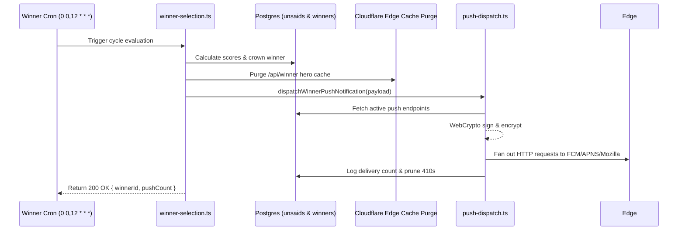

# Phase 7 — Real Web Push Notification Delivery (VAPID End-to-End)
*Exhaustive Master Implementation Plan for Senior Engineering Execution*

---

> [!IMPORTANT]
> **Prerequisite Gate:** Phase 6 ([11_phase6_winner_pipeline_and_scheduled_scoring.md](file:///c:/Users/mughe/OneDrive/Desktop/Personal%20projects/thought-wellspring/plans/11_phase6_winner_pipeline_and_scheduled_scoring.md)) must be in place.
> The automated 12-hour winner cycle produces crowned unsaids. Phase 7 implements the delivery conduit that alerts users the instant a new hero unsaid is crowned.
>
> **Implementation Standard:** This document contains **no application code implementations**. It is an exhaustive architectural, cryptographic, and operational blueprint engineered for a senior systems engineer. It specifies Web Crypto RFC 8291/8292 payloads, Cloudflare Workers execution constraints, database schemas, pruning mechanics, Service Worker routing, and QA verification matrices.

---

## Part 0: Executive Architecture & System Overview

### 0-A: The Purpose of Web Push in BajiHears
BajiHears is an anonymous communal space operating on a synchronous 12-hour cultural cycle. Without proactive re-engagement, retention decays exponentially after the initial visit. Real Web Push notifications provide the vital heartbeat:
1. **The 12-Hour Crown Broadcast:** Notifying subscribers immediately when a new confession wins the hero spot (at 00:00 UTC and 12:00 UTC).
2. **Anonymous-First Retention:** Retaining users without forcing them to register an email address or OAuth account.
3. **Zero-Spam Cadence:** Strictly capping notifications to at most one broadcast per 12-hour cycle (with `tag` collapsing to prevent notification stacking).

### 0-B: End-to-End System Topology

```mermaid
graph TD
    subgraph Client Browser
        UI[PushPermissionSheet / Settings UI]
        SW[public/sw.js Service Worker]
        PUSH_MGR[navigator.serviceWorker.pushManager]
    end

    subgraph Edge / Cloudflare Workers
        API_SUB[/api/push/subscribe Endpoint]
        JOB_DISPATCH[server/jobs/push-dispatch.ts]
        CRYPTO_ENGINE[Native WebCrypto RFC 8291 / 8292 Signer]
    end

    subgraph Database Layer / Supabase
        DB_SUB[(anonymous_subscriptions)]
        DB_PROF[(profiles.push_subscription)]
        DB_LOG[(push_delivery_logs)]
    end

    subgraph Push Service Providers
        FCM[Google FCM / Chrome]
        APNS[Apple Web Push / Safari]
        MOZ[Mozilla Autopush / Firefox]
    end

    UI -->|1. Request Permission| PUSH_MGR
    PUSH_MGR -->|2. Generate PushSubscription| UI
    UI -->|3. POST serialized subscription| API_SUB
    API_SUB -->|4. Upsert subscription| DB_SUB
    API_SUB -->|4b. Link if authenticated| DB_PROF

    JOB_DISPATCH -->|5. Triggered by Winner Pipeline| CRYPTO_ENGINE
    JOB_DISPATCH -->|6. Batch query active subscriptions| DB_SUB
    CRYPTO_ENGINE -->|7. Encrypted payload + VAPID JWT| FCM
    CRYPTO_ENGINE -->|7. Encrypted payload + VAPID JWT| APNS
    CRYPTO_ENGINE -->|7. Encrypted payload + VAPID JWT| MOZ

    FCM -->|8. Push to device| SW
    APNS -->|8. Push to device| SW
    MOZ -->|8. Push to device| SW

    SW -->|9. showNotification| UI
    SW -->|10. Click opens /| UI
    FCM -.->|410 Gone / 404 Not Found| JOB_DISPATCH
    JOB_DISPATCH -.->|11. Prune dead endpoints| DB_SUB
```

---

## Part 1: Comprehensive Current State vs. Target State Audit

### 1-A: Current State Audit (What Exists in Codebase)
1. **`public/sw.js`:**
   - Already has skeleton listeners for `push` and `notificationclick`.
   - Hardcoded default titles and URLs exist.
   - Missing payload validation, security token checks, and dynamic routing parameters.
2. **`src/client/lib/notifications.ts`:**
   - Helper functions exist: `registerServiceWorker()`, `requestPushPermission()`, `hasPushPermission()`, `shouldShowPushPrompt()`, `markPushPromptShown()`.
   - **Crucial gap:** It does *not* call `pushManager.subscribe()`. It only checks the browser permission string.
   - **Crucial gap:** It never serializes the endpoint keys (`p256dh`, `auth`) or transmits them to the server.
3. **`src/server/functions/notifications.ts`:**
   - Has a stub function `savePushSubscription(env, input)` that attempts to write to `profiles.push_subscription`.
   - Fails completely for anonymous users who do not have an authenticated `profiles` record.
4. **`src/server/jobs/push-dispatch.ts`:**
   - Exists as a mocked stub that merely logs `Winner notification queued`. Zero actual network dispatch occurs.

### 1-B: Target State Specification
1. Full VAPID public/private key lifecycle with environment variable segregation.
2. Client-side conversion of VAPID public key via URL-safe Base64 to `Uint8Array`.
3. Dedicated `anonymous_subscriptions` database table with device-token anchoring and composite unique index on `endpoint`.
4. Cloudflare Worker compatible Web Push dispatcher built exclusively on standard `crypto.subtle` (no heavy Node.js `web-push` npm package dependencies that crash on Cloudflare Pages runtime).
5. Batched concurrency pipeline with auto-pruning of dead (HTTP 410 / 404) subscriptions.

---

## Part 2: Cryptographic Foundation & Cloudflare Runtime Constraints

### 2-A: Why Node.js `web-push` Cannot Be Used on Cloudflare Edge
- The standard npm package `web-push` relies on Node.js core modules (`crypto`, `http`, `https`, `url`, `zlib`, `stream`).
- Cloudflare Pages Functions and Cloudflare Workers run on the V8-based workerd runtime. Attempting to bundle `web-push` introduces polyfill overhead, massive bundle sizes, and runtime breakages during ECDH key derivation.
- **The Senior Architecture Decision:** Implement Web Push encryption directly using the standard W3C **Web Crypto API** (`crypto.subtle`), which is natively supported with zero dependencies on Cloudflare Workers, Node 18+, Bun, and modern browsers.

### 2-B: Cryptographic Protocols Required (RFC 8291 & RFC 8292)
1. **VAPID Authentication (RFC 8292):**
   - Application Server Key: NIST P-256 (secp256r1) elliptic curve keypair.
   - VAPID JWT Header: `{"typ":"JWT","alg":"ES256"}`.
   - VAPID JWT Claims:
     - `aud`: The origin of the push service endpoint (e.g., `https://fcm.googleapis.com` or `https://push.services.mozilla.com`).
     - `exp`: Expiration timestamp (strictly within 12 to 24 hours).
     - `sub`: Contact URI (e.g., `mailto:admin@bajihears.com` or platform URL).
   - Signed with ECDSA using SHA-256 (`ES256`) via `crypto.subtle.sign()`.
   - Sent via HTTP Header: `Authorization: vapid t=<jwt>, k=<uncompressed_public_key_base64url>`.

2. **Payload Encryption (RFC 8291 - aes128gcm):**
   - Each push recipient provides:
     - `endpoint`: The push server target URL.
     - `p256dh`: Client's public key (P-256 uncompressed EC point, 65 bytes).
     - `auth`: Client's authentication secret (16 bytes random salt).
   - Server generates ephemeral P-256 keypair for each message.
   - Computes shared secret via ECDH (`crypto.subtle.deriveBits()`).
   - Uses HKDF (HMAC-based Key Derivation Function) with `auth` secret to derive Content Encryption Key (CEK) and Nonce.
   - Encrypts JSON payload using `AES-GCM-128`.
   - Appends 86-byte header containing salt, record size, and server's ephemeral public key.

---

## Part 3: Database Architecture & Schema Design

### 3-A: Table Specification: `anonymous_subscriptions`

```sql
CREATE TABLE public.anonymous_subscriptions (
    id UUID PRIMARY KEY DEFAULT gen_random_uuid(),
    device_token TEXT NOT NULL,
    endpoint TEXT NOT NULL,
    p256dh TEXT NOT NULL,
    auth TEXT NOT NULL,
    user_agent TEXT,
    is_active BOOLEAN NOT NULL DEFAULT true,
    failure_count INTEGER NOT NULL DEFAULT 0,
    created_at TIMESTAMPTZ NOT NULL DEFAULT now(),
    last_delivered_at TIMESTAMPTZ,
    last_error TEXT,
    CONSTRAINT unique_endpoint UNIQUE (endpoint)
);
```

### 3-B: RLS (Row Level Security) Policies
- **ANON / PUBLIC INSERT / UPDATE:**
  - Clients can register or refresh their subscription matching their `device_token`.
  - Clients can never select or inspect other devices' subscription endpoints.
- **SERVICE_ROLE / ADMIN:**
  - Full read, write, update, and prune access for the Cloudflare Worker dispatch job.

### 3-C: Table Indexes
- `CREATE INDEX idx_anon_sub_active ON public.anonymous_subscriptions(is_active) WHERE is_active = true;`
- `CREATE INDEX idx_anon_sub_device ON public.anonymous_subscriptions(device_token);`
- `CREATE INDEX idx_anon_sub_endpoint ON public.anonymous_subscriptions(endpoint);`

### 3-D: Account Linking (Guest Carry-Over Integration)
- When an anonymous user signs in via Google OAuth (Phase 3):
  - Their `device_token` is linked to their new `user_id`.
  - The subscription is mirrored to `profiles.push_subscription` or tagged with `user_id` to prevent duplicate delivery to the same physical device.

---

## Part 4: Client-Side Lifecycle & Service Worker Mechanics

### 4-A: Safe Base64-to-Uint8Array Utility
The VAPID public key is exposed as a URL-safe Base64 string. The browser `PushManager.subscribe` API requires an `ArrayBuffer` / `Uint8Array`.
- Padding characters (`=`) must be re-appended if truncated.
- URL-safe characters (`-` and `_`) must be translated to standard Base64 (`+` and `/`).
- Conversion must happen safely without throwing exceptions on malformed strings.

### 4-B: Subscription Flow in `PushPermissionSheet.tsx`
1. User clicks "Enable Notifications".
2. Check `Notification.requestPermission()`. If granted:
3. Await `navigator.serviceWorker.ready` to retrieve active `registration`.
4. Check if `registration.pushManager.getSubscription()` already exists:
   - If exists and key matches: reuse existing subscription.
   - If exists with stale key: call `existingSubscription.unsubscribe()` and renew.
   - If none: call `registration.pushManager.subscribe({ userVisibleOnly: true, applicationServerKey: convertedKey })`.
5. Serialize subscription into JSON `{ endpoint, keys: { p256dh, auth } }`.
6. Dispatch to server endpoint `/api/push/subscribe` alongside current `device_token`.
7. Persist local consent flag `bh:pushEnabled = true` to avoid re-prompting.

### 4-C: iOS Safari PWA Matrix & Edge Cases
- **iOS 16.4+ Requirement:** Web Push on iOS *only* functions if the user has added the website to their Home Screen (standalone PWA mode: `window.navigator.standalone === true`).
- If iOS Safari is detected in regular browser mode, the UI must explain: *"Tap Share -> Add to Home Screen to enable instant alerts."*
- If Notification API is missing entirely, UI gracefully suppresses push triggers without errors.

### 4-D: Upgraded Service Worker (`public/sw.js`)
- **`push` Listener:**
  - Safely parses JSON data with fallback defaults.
  - Generates notification options:
    - `title`: `"The new winner is in ✨"`
    - `body`: Post excerpt truncated to 120 characters with quotes.
    - `icon`: `/favicon.png`
    - `badge`: `/favicon.png`
    - `tag`: `"bajihears-winner"` (collapses multiple notifications into one).
    - `renotify`: `true` (vibrates/alerts user even if previous winner is still in tray).
    - `data`: `{ url: "/", winnerId: payload.winnerId, timestamp: Date.now() }`.
- **`notificationclick` Listener:**
  - Closes the active notification banner.
  - Queries open browser windows matching the origin.
  - If a window is open, focuses that window and navigates to the target URL.
  - If no window is open, calls `clients.openWindow(url)`.

---

## Part 5: Server-Side Push Dispatch Engine

### 5-A: The Dispatch Pipeline (`server/jobs/push-dispatch.ts`)
When the 12-hour winner cycle crowns a new post (from Phase 6):
1. Format winner payload:
   ```json
   {
     "title": "The new winner is in ✨",
     "body": "\"I never told anyone this, but...\"",
     "url": "/?winner=true",
     "winnerId": "uuid-here",
     "cycleTimestamp": 1727280000000
   }
   ```
2. Query active subscriptions from database:
   - Query `anonymous_subscriptions` where `is_active = true`.
   - Query `profiles` where `push_subscription IS NOT NULL`.
   - Deduplicate across endpoint URLs to prevent double-buzzing users who linked accounts.
3. Batch Processing & Rate Limiting:
   - Slice subscribers into chunks of 50 concurrent requests.
   - Execute dispatches in parallel using `Promise.allSettled`.
   - Prevent overwhelming Cloudflare subrequest limits (Cloudflare Workers allow up to 50 simultaneous subrequests per request).

### 5-B: Handling HTTP Responses from Push Services
| HTTP Status Code | Meaning | System Action |
| :--- | :--- | :--- |
| **201 Created** | Delivered to push server | Update `last_delivered_at = now()`, reset `failure_count = 0`. |
| **404 Not Found** | Subscription expired/removed | Mark `is_active = false`, delete or schedule for pruning. |
| **410 Gone** | User revoked permission | Immediate soft-delete: `is_active = false`, set `last_error = '410 Gone'`. |
| **429 Too Many Requests** | Rate limited by FCM/Apple | Exponential backoff retry or skip batch. |
| **400 / 401 Unauthorized** | VAPID key mismatch / invalid JWT | Log critical alarm: check VAPID subject and private key validity. |

### 5-C: Dead Endpoint Auto-Pruning Routine
- Any subscription returning `410 Gone` or `404 Not Found` is immediately deactivated.
- A nightly maintenance query removes deactivated subscriptions older than 30 days to keep the database lean.

---

## Part 6: Phase 6 ↔ Phase 7 Handshake (Winner Crown Integration)

### 6-A: Hook in `winner-selection.ts`
At the conclusion of `executeWinnerSelection()` in `server/jobs/winner-selection.ts`:


### 6-B: Idempotency Safeguard
To prevent multiple notifications if a cron triggers more than once:
- Check `push_delivery_logs` for `cycle_timestamp`.
- If a push broadcast was already executed for the current cycle window, exit immediately with status `ALREADY_DISPATCHED`.

---

## Part 7: Step-by-Step Senior Implementation Blueprint

### Step 1: Database Migration
- Create migration `supabase/migrations/20260927000000_phase7_push_subscriptions.sql`.
- Create `anonymous_subscriptions` table with RLS enabled.
- Add indexes on `endpoint`, `is_active`, and `device_token`.
- Add `push_delivery_logs` audit table for broadcast tracking.

### Step 2: Native Web Crypto Helper (`src/server/lib/web-crypto-push.ts`)
- Implement zero-dependency VAPID JWT generation using `crypto.subtle.sign("ECDSA", ...)`.
- Implement RFC 8291 payload encryption using `crypto.subtle.deriveBits("ECDH", ...)` and `AES-GCM-128`.
- Export unified function `sendWebPush(subscription, payload, vapidKeys)`.

### Step 3: Subscription Endpoint (`src/routes/api/push/subscribe.ts` or Server Function)
- Validate incoming endpoint URL format and base64 encryption keys.
- Upsert into `anonymous_subscriptions` using service role client.
- Return HTTP 200 `{ success: true }`.

### Step 4: Client Push Manager Enhancement (`src/client/lib/notifications.ts`)
- Add `urlBase64ToUint8Array` converter.
- Implement `subscribeDeviceToPush(vapidPublicKey, deviceToken)`.
- Connect to `PushPermissionSheet.tsx` confirmation callback.

### Step 5: Service Worker Upgrade (`public/sw.js`)
- Update notification display logic with rich typography and badge support.
- Implement robust focus-or-open navigation in `notificationclick`.

### Step 6: Dispatch Pipeline Activation (`src/server/jobs/push-dispatch.ts`)
- Replace mock stub with batch dispatch query and concurrency runner.
- Wire into `src/server/jobs/winner-selection.ts`.

---

## Part 8: Verification & QA Testing Matrix

| Test Case | Procedure | Expected Outcome |
| :--- | :--- | :--- |
| **VAPID Key Generation** | Run `npx web-push generate-vapid-keys` | Outputs matching pair of Base64 strings. |
| **Client Subscription** | Grant permission in UI on Chrome/Edge | Browser registers subscription; row appears in `anonymous_subscriptions`. |
| **Payload Encryption** | Execute `sendWebPush` in test suite | Push service returns HTTP 201 Created. |
| **Delivery to Desktop** | Trigger manual push test | OS banner appears with title `"The new winner is in ✨"`. |
| **Banner Tap Interaction** | Click notification while app is closed | Browser launches and navigates to `/?winner=true`. |
| **Banner Tap While Open** | Click notification while tab is open | Existing tab receives focus immediately. |
| **Dead Endpoint Pruning** | Revoke browser permission, trigger push | Push returns 410; database sets `is_active = false`. |
| **Duplicate Prevention** | Trigger cron twice within 5 minutes | Second call detects logged cycle and skips dispatch. |

---

## Part 9: What You Need to Provide to Begin Execution

To implement Phase 7 in your live environment, please provide or complete the following three items:

1. **VAPID Key Generation:**
   - Run this single command in your terminal:
     ```bash
     npx web-push generate-vapid-keys
     ```
   - It will display a **Public Key** and a **Private Key**.
   - **Provide me:** The **Public Key** (safe to share).
   - **Keep private:** The **Private Key** (store it in your `.env.local` or Cloudflare Secrets as `VAPID_PRIVATE_KEY`).

2. **VAPID Contact Subject:**
   - A contact email or URL for the push service provider (e.g. `mailto:your-email@example.com` or `https://bajihears.com`).

3. **Supabase Migration Execution Approval:**
   - I will generate the clean, safe SQL migration for `anonymous_subscriptions` and `push_delivery_logs`.
   - You can run it directly in your Supabase SQL Editor just like you did for Phase 5 and Phase 6.
