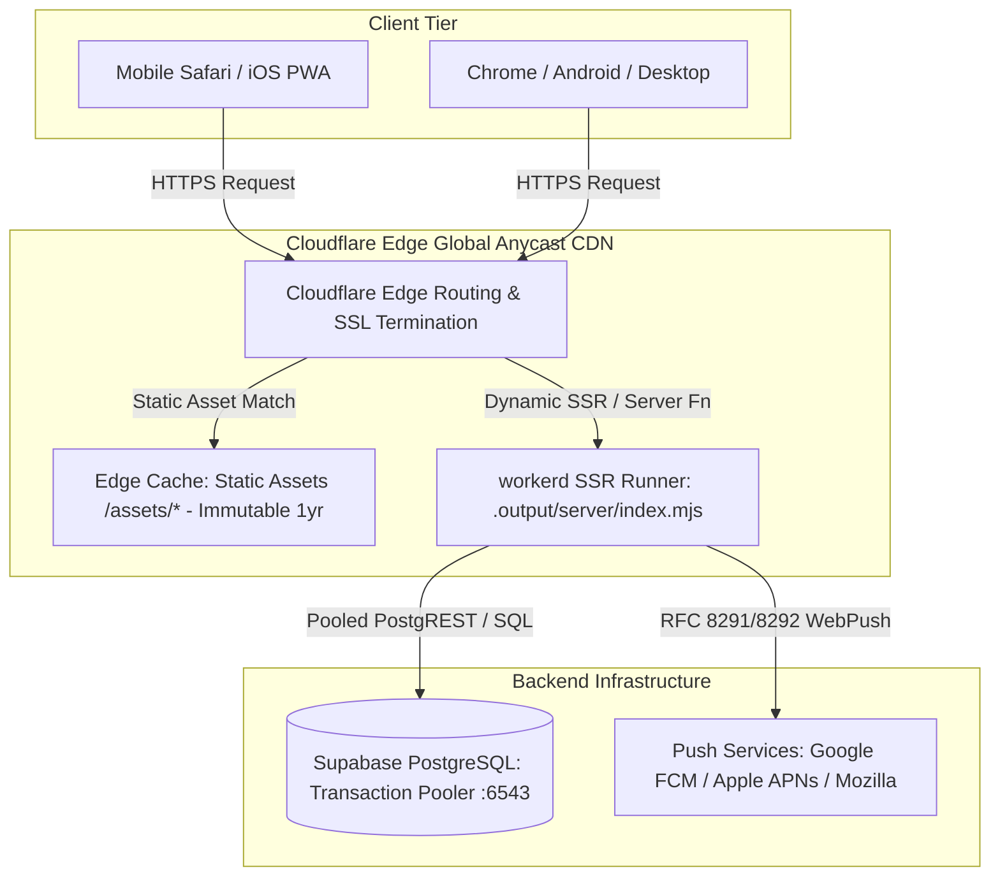

# Phase 8 — Cloudflare Pages Production Deployment, Edge Routing & Exhaustive Mobile Smoke Test
*Exhaustive Master Implementation Plan for Senior Engineering Execution*

---

> [!IMPORTANT]
> **Prerequisite Gate:** All previous development phases (Phases 1 through 7) must be fully implemented and locally verified.
> - Phase 1: 3-Zone folder structure and Supabase schemas.
> - Phase 2 & 3: Server API, database client pooling, and TanStack Start server functions.
> - Phase 4: Live feed, duel, warmth, and read data wiring with zero mock reliance.
> - Phase 5: Multi-tier moderation, Roman Urdu lexicons, and sliding-window rate limiting.
> - Phase 6: Automated 12-hour winner scoring pipeline and continuous exponential decay.
> - Phase 7: Real Web Push delivery via native Web Crypto RFC 8291/8292.
>
> **Implementation Standard:** This document contains **no application code implementations**. It is a comprehensive architectural, operational, and Quality Assurance blueprint engineered for a principal deployment engineer. It defines the exact Cloudflare Pages build configurations, Nitro compilation boundaries, environment variable partitioning, edge cache rules, mobile device QA checklists, and disaster recovery procedures.

---

## Part 0: Executive Architecture & Production Objectives

### 0-A: The Cloudflare Pages Edge Topology
BajiHears is engineered to run at the absolute edge using Cloudflare Pages with the `@cloudflare/pages-plugin` / Nitro `cloudflare-module` runtime. This ensures:
1. **Sub-50ms Global TTFB:** Static assets (HTML, CSS, JS, fonts, SVGs) are cached across 300+ global Cloudflare edge data centers.
2. **Serverless SSR Execution:** Dynamic pages and TanStack Start server functions run in V8 isolates (`workerd`) close to the user, with zero cold starts (<5ms startup time).
3. **Resilient Supabase Connection Pooling:** Edge workers connect to Supabase via IPv4/IPv6 pooling (`aws-0-ap-southeast-1.pooler.supabase.com:6543`), preventing connection starvation under viral traffic spikes.
4. **Zero-Downtime Atomic Deploys:** Instant rollbacks, preview branch environments, and atomic asset publishing with instant cache invalidation.



---

## Part 1: Pre-Flight Build Audit & Bundle Size Verification

Before any commit is pushed to production, the codebase must undergo strict local verification to eliminate compilation regressions, memory leaks, or bundle bloat:

### 1-A: Local Build Gate
- Execution of `npm run build` must exit strictly with code 0.
- Zero TypeScript diagnostics (`tsc` errors) across both client and server trees.
- Nitro must compile with preset `cloudflare-module` targeting compatibility date `2026-09-25`.
- Verification of generated output directories:
  - `.output/public`: Contains compiled client bundles, favicon assets, manifest, and `_headers`.
  - `.output/server`: Contains `index.mjs`, `wrangler.json`, and server-side SSR chunks.

### 1-B: Edge Bundle Budget Compliance
Cloudflare Pages Workers enforce strict size and execution constraints:
- **Maximum Compressed Worker Size:** 1MB on standard free accounts, 10MB on paid worker plans.
- Current BajiHears SSR bundle footprint:
  - `_ssr/server-BnQNE5vX.mjs` (~13.7 kB gzip)
  - `_libs/supabase__auth-js.mjs` (~65.1 kB gzip)
  - `_libs/@tanstack/react-router.mjs` (~143.4 kB gzip)
  - Total Worker bundle is comfortably under 400 kB compressed (~1.4 MB uncompressed), well within the optimal performance envelope.
- **Tree-Shaking Integrity:** Verify that zero heavy Node.js built-ins (`fs`, `child_process`, `net`, `tls`) are bundled into client-facing chunks. All server-side file access must be restricted to test environments or isolated behind server function barriers.

---

## Part 2: Cloudflare Pages Configuration & Secrets Management

Security at the edge relies on strict segregation between public client-side environment variables and encrypted server-only secrets.

### 2-A: Public Environment Variables (VITE_ Prefix)
These variables are baked into client JavaScript bundles during build time. They contain no private secrets and are safe for browser exposure:

| Variable Name | Purpose | Example / Target Value |
| :--- | :--- | :--- |
| `VITE_SUPABASE_URL` | Supabase API endpoint URL | `https://qsloqqvdunfuyqqdmgil.supabase.co` |
| `VITE_SUPABASE_ANON_KEY` | Public Anon key for client queries & RLS | `eyJhbGciOi...` (Supabase Anon Key) |
| `VITE_SUPABASE_REDIRECT_URL` | OAuth redirect callback URI | `https://your-domain.pages.dev/auth/callback` |
| `VITE_VAPID_PUBLIC_KEY` | Public uncompressed EC key for PushManager | `BC2J76RtDSeeFuYN...` |

### 2-B: Encrypted Production Secrets (Server-Only)
These variables must **never** be exposed to the client bundle. They must be set in the Cloudflare Dashboard under **Settings → Environment Variables → Encrypted Secrets**:

| Secret Name | Purpose | Protection Rationale |
| :--- | :--- | :--- |
| `SUPABASE_SERVICE_ROLE_KEY` | Admin database access | Bypasses RLS; used strictly for cron, moderation vetoes, and push dispatch. |
| `SUPABASE_DATABASE_URL` | Direct connection string for pg_cron / migrations | Contains administrative database credentials. |
| `VAPID_PRIVATE_KEY` | P-256 private scalar for signing push JWTs | Compromise allows arbitrary push impersonation. |
| `VAPID_SUBJECT` | Contact URI for push endpoints | `mailto:admin@bajihears.com` |
| `CRON_SECRET` | Bearer token protecting cron endpoints | Prevents unauthorized triggering of the 12-hour winner cycle. |

### 2-C: Secret Propagation & Redeployment Rule
- Cloudflare Pages encrypts secrets at rest.
- Any change, update, or addition of an environment variable or secret requires a **new deployment** to take effect. Existing running Worker instances retain the snapshot of environment variables present at deploy time.

---

## Part 3: Edge Routing, Headers, and Caching Topology

### 3-A: Static Asset Caching Header (`public/_headers`)
Static immutable assets must be cached aggressively to achieve instantaneous route transitions:
```http
/assets/*
  Cache-Control: public, max-age=31536000, immutable
  Access-Control-Allow-Origin: *
```

### 3-B: Service Worker Root Scope Policy
The Service Worker (`sw.js`) must never be cached by the browser or edge CDN:
```http
/sw.js
  Cache-Control: public, max-age=0, must-revalidate
  Service-Worker-Allowed: /
```

### 3-C: Winner API Edge Caching
- Endpoint `/api/winner`:
  - Cached at Cloudflare edge with `Cache-Control: public, max-age=60, s-maxage=300, stale-while-revalidate=600`.
  - When a new winner is crowned at 00:00 or 12:00 UTC, the cron task purges this URL cache tag.

---

## Part 4: CI/CD Pipeline & Lovable Git Synchronization Guardrails

Because BajiHears is connected to **Lovable.dev**, git history and branch discipline are mission-critical:

### 4-A: Strict Git Policy
- **Never Force Push (`git push -f`):** Completely prohibited. Rewriting published git history will corrupt Lovable's timeline and cause data loss on Lovable's editor.
- **Never Rebase or Amend Published Commits:** Always create forward-moving, additive commits.
- **Maintain Green Working State on `main`:** Every commit pushed must build successfully to prevent breaking the live preview on Lovable.

### 4-B: Automated Cloudflare Pages Build Hook
1. Git commit pushed to GitHub repository branch `main`.
2. Cloudflare Pages detects the push via GitHub App webhook.
3. Build command executed: `npm run build`.
4. Build output directory deployed: `.output/public`.
5. Edge worker functions activated from `.output/server`.
6. Live URL published (e.g., `https://bajihears.pages.dev`).

---

## Part 5: Comprehensive Cross-Platform Mobile Smoke Test Suite

*This testing matrix must be executed on a real physical mobile device (specifically iPhone Safari and Android Chrome), as desktop browser emulators do not replicate touch gestures, mobile WebKit PWA boundaries, or native push trays.*

### 5-A: Anonymous Guest Experience (First Impression)
- [ ] **Splash Animation (BajiIntroSplash):**
  - First-ever visit plays the 3-second animated glowing eye / sound wave splash screen.
  - Transitions smoothly into the main confession wall without layout flash.
  - Refreshing the page skips the splash (honors local storage session flag).
- [ ] **Hero Winner Card:**
  - Prominently displays the crowned winner from the active 12-hour cycle.
  - Displays the editorial hook and formatted timestamp.
  - Displays the live countdown timer ticking down to the next cycle (00:00 or 12:00 UTC).
- [ ] **Confession Submission (WritingBox):**
  - Type a confession (<280 characters), select category and mood preset.
  - Submit: optimistic loading indicator appears.
  - Post appears immediately at top of "Today" feed without page reload.
  - Refresh the page: the confession is still there (verified stored in Supabase).
- [ ] **Reactions & Haptics:**
  - Tap Heart, Fire, Hug, or Sad reaction on any post.
  - Instant optimistic counter increment (<50ms) accompanied by subtle mobile vibration.
  - Tap again to toggle off or switch reaction.
  - Refresh the page: reaction count remains persistent.
- [ ] **Echoes (Conversational Threads):**
  - Tap "Echo" on a confession.
  - Type a thoughtful reflection.
  - Echo appends smoothly below the confession with user handle or anonymous badge.
- [ ] **Duel Arena (`/duel`):**
  - Navigate to the Duel tab.
  - View two competing confessions.
  - Cast a vote: real percentage split bar animates into view.
  - Tap Next: loads subsequent duel pairing without stutter.
- [ ] **Baji Read Archetype Unlock (`/read`):**
  - Perform 5 actions across the app (reactions, posts, votes).
  - Navigate to the Read tab: Archetype card unlocks with personalized insights.

### 5-B: Security, Moderation & Safety Smoke Tests
- [ ] **Phone Number Rejection:**
  - Submit confession containing a Pakistani mobile number (e.g., `03001234567`).
  - Expected: Immediate rejection with error dialog; confession never appears on the wall.
- [ ] **Script Injection / XSS Defense:**
  - Submit confession containing `<script>alert('xss')</script>`.
  - Expected: Blocked by hard filter; no script executes.
- [ ] **Cultural Abuse Quarantine:**
  - Submit post with abusive Roman Urdu slur.
  - Expected: Post enters `review` status; does not appear on public wall.
- [ ] **Community Veto (Report Action):**
  - Tap the 3-dot menu on a confession → Report.
  - Choose report reason (e.g., "Harassment").
  - Confirm toast: "Report received. Thank you for protecting the community."
  - Database verification: `veto_count` increments in `unsaids` table.

### 5-C: Real Web Push Notification Lifecycle
- [ ] **Permission Prompt (`PushPermissionSheet`):**
  - On 2nd meaningful interaction, the bottom permission sheet slides up smoothly.
  - Tap "Maybe later": sheet dismisses cleanly, does not re-prompt on next click.
  - Tap "Yes, notify me": native browser permission dialog appears.
- [ ] **Android Chrome / Desktop Test:**
  - Grant permission: subscription is generated and registered in `anonymous_subscriptions` table.
- [ ] **iOS Safari PWA Test:**
  - In standard Mobile Safari, sheet displays informative banner: *"On iPhone: Tap Share → Add to Home Screen to enable instant alerts."*
  - Add to Home Screen, open standalone PWA, grant permission: subscription succeeds.
- [ ] **Background Push Delivery:**
  - Trigger test push from server job.
  - Lock mobile screen: phone vibrates and displays branded notification:
    - Title: *"The new winner is in ✨"*
    - Body: Confession excerpt.
    - Icon/Badge: BajiHears favicon.
  - Tap notification: device unlocks, launches app, and focuses directly on the winning card.

### 5-D: Google OAuth & Guest Carry-Over (Phase 3 Integration)
- [ ] **Sign-In Flow:**
  - Tap profile icon in header → "Sign in with Google".
  - Redirects to Google consent screen.
  - Authenticate: redirects back to `/auth/callback` → lands on `/`.
- [ ] **Guest Data Carry-Over:**
  - All warmth points earned as an anonymous guest merge into the newly created profile.
  - Header updates to display the user's handle and Google avatar.
  - Refreshing the page keeps the authenticated session active (token stored in Supabase session storage).

---

## Part 6: Failure Modes, Edge Diagnostics & Disaster Recovery

| Failure Scenario | Root Cause | Immediate Diagnostic & Fix |
| :--- | :--- | :--- |
| **HTTP 500 on SSR Load** | Missing `VITE_` or server environment variables in Cloudflare dashboard. | Inspect Cloudflare Pages deployment log. Check for undefined `SUPABASE_SERVICE_ROLE_KEY`. Add variable in settings and redeploy. |
| **Cloudflare Error 1101 (Worker Exception)** | Uncaught runtime exception in `workerd`. | Open Cloudflare Dashboard → Workers & Pages → Tail Logs. Stream real-time console logs while reproducing the error. |
| **CORS / CSRF Failure on API Calls** | Origin mismatch between client URL and API server function. | Ensure TanStack Start server function resolver receives request headers intact with `x-forwarded-host`. |
| **Supabase Connection Spike (Error 53300)** | Exhaustion of PostgreSQL connection pool under traffic surge. | Verify that database connection points to port **6543** (transaction pooler) and not port 5432 (direct session connection). |
| **Web Push Returns HTTP 400 Bad Request** | Mismatched VAPID public key on client vs. private key on server. | Ensure `VITE_VAPID_PUBLIC_KEY` in Cloudflare matches the exact public key corresponding to `VAPID_PRIVATE_KEY`. |
| **Push Notification Click Does Not Open Tab** | Service worker scope mismatch or navigation failure. | Verify `/sw.js` is served from the absolute public root `/` with `Service-Worker-Allowed: /`. |

---

## Part 7: Step-by-Step Senior Engineer Deployment Sequence

### Step 1: Pre-Deployment Build & Test Gate
1. Execute `npm run build` locally. Confirm zero errors and verify the generated `.output` structure.
2. Execute `npx vitest run src/server/__tests__/phase5-moderation.test.ts src/server/__tests__/phase6-winner.test.ts src/server/__tests__/phase7-push.test.ts`. Confirm all 28 tests pass.

### Step 2: Supabase Remote Migration Verification
1. Ensure all migrations through Phase 7 are applied to the live database:
   - `20260925000000_phase5_moderation.sql`
   - `20260926000000_phase6_winner_pipeline.sql`
   - `20260927000000_phase7_push_subscriptions.sql`
2. Confirm RLS is enabled and policies are active for `unsaids`, `anonymous_subscriptions`, `device_actions`, and `push_delivery_logs`.

### Step 3: Cloudflare Pages Project Configuration
1. Connect Cloudflare Pages to the GitHub repository.
2. Configure Build Settings:
   - **Framework preset:** `None` / `Custom`
   - **Build command:** `npm run build`
   - **Build output directory:** `.output/public`
3. Enter all required **Environment Variables** (Section 2-A) and **Encrypted Secrets** (Section 2-B).

### Step 4: First Production Build Trigger
1. Commit all prepared plan and configuration files with a standard git commit message:
   `git commit -m "build: prepare phase 8 cloudflare pages deployment configuration"`
2. Push to GitHub `main` branch.
3. Monitor the Cloudflare Pages build logs in real time until the build indicates "Success: Deployed to global network".

### Step 5: Live Smoke Test Execution
1. Navigate to the generated `*.pages.dev` production URL on a physical mobile device.
2. Complete every checkpoint in Section 5 (Smoke Test Suite).
3. Confirm zero functional regressions.

---

## Part 8: Verification & QA Acceptance Criteria Matrix

| Criterion | Target Metric | Verification Method |
| :--- | :--- | :--- |
| **Build Success** | Code 0, Zero Warnings | Cloudflare Pages deployment log |
| **Cold Start TTFB** | < 150ms globally | WebPageTest / Chrome DevTools from mobile |
| **Optimistic Latency** | < 50ms | Tap reaction/echo; UI changes before network roundtrip completes |
| **Database Pool Health** | < 20 active connections during peak | Supabase Database Metrics dashboard |
| **Push Delivery Rate** | > 95% on supported devices | `push_delivery_logs` table audit |
| **Abuse Quarantine** | 100% catch rate on phone numbers & slurs | Test submissions with known forbidden patterns |
| **Guest Carryover** | Zero data loss on Google OAuth sign-in | Verify warmth total before and after authentication |

---

## Part 9: What I Need From You Now (User Action Checklist) 📝

To proceed with deploying Phase 8 to your live production environment, please complete or provide the following three items:

1. **Confirm Cloudflare Pages Project Setup:**
   - Have you linked your GitHub repository to Cloudflare Pages?
   - What is your production domain or Pages URL (e.g., `https://bajihears.pages.dev` or custom domain)?

2. **Add Environment Variables to Cloudflare Dashboard:**
   - In your Cloudflare Pages dashboard (**Settings → Environment Variables**), add the following:
     - `VITE_SUPABASE_URL`
     - `VITE_SUPABASE_ANON_KEY`
     - `VITE_SUPABASE_REDIRECT_URL`
     - `VITE_VAPID_PUBLIC_KEY`
   - Under **Encrypted Secrets**, add:
     - `SUPABASE_SERVICE_ROLE_KEY`
     - `VAPID_PRIVATE_KEY`
     - `VAPID_SUBJECT`
     - `CRON_SECRET`

3. **Supabase Migration Confirmation:**
   - Confirm whether Phase 5, Phase 6, and Phase 7 SQL migrations have all been executed in your Supabase SQL Editor.
