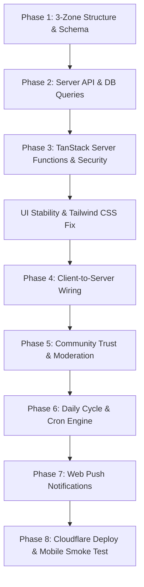

# BajiHears — Implementation Plans & Architecture Specifications

This directory contains the complete archive of all engineering, architecture, and retention plans created for **BajiHears**.

---

## Plan Directory & Navigation

| # | Plan File | Scope / Focus | Status |
|---|---|---|---|
| **00** | [Master Implementation Plan](./00_master_implementation_plan.md) | Exhaustive end-to-end production roadmap across all 7 phases (Folder restructure, Supabase, API, Client wiring, Moderation, Cron, Push). | Active Blueprint |
| **01** | [Phase 1: Folder Restructure & Schema](./01_phase1_folder_restructure_and_schema.md) | Physical 3-zone architecture (`client/`, `server/`, `shared/`) & complete Supabase SQL schema with Row-Level Security. | ✅ Completed (`cad18da`) |
| **02** | [Phase 2: Server API Layer](./02_phase2_server_api_layer.md) | Supabase client pooling, DB query modules, rate limiting, spam filtering, and standalone verification suite. | ✅ Completed (`22f7029`) |
| **03** | [Phase 3: TanStack Start Server Functions](./03_phase3_tanstack_start_server_functions.md) | HTTP route handlers, `createServerFn` bindings, CSRF protection, security headers, and error envelopment. | ✅ Completed (`98a0cca`) |
| **04** | [High-Retention Community Plan](./04_high_retention_community_plan.md) | Viral loops, psychological hooks (Wordle/BeReal/Duolingo style), D7 retention goals, and growth mechanics. | Reference Spec |
| **05** | [Developer Technical Specification](./05_developer_technical_specification.md) | Comprehensive technical specification covering identity, scoring formulas, Warmth economy, and component contracts. | Reference Spec |
| **06** | [Client Retention Engine Plan](./06_client_retention_engine_plan.md) | Client-side simulation of progressive disclosure, duel voting scarcity, Baji Read archetypes, and toast animations. | ✅ Completed (`27c7b4b`) |
| **07** | [Failure Analysis & Retention Audit](./07_failure_analysis_and_retention_audit.md) | Root-cause analysis of prior post board failures (Yik Yak, Secret) and how BajiHears overcomes them. | Audit & Rationale |
| **08** | [UI Stability & Styling Repair Plan](./08_ui_stability_and_styling_repair_plan.md) | Resolution of `WINNER` runtime reference crash, Tailwind v4 CSS loading fix, and TypeScript strict compiler fixes. | ✅ Completed (`6a5c6e7`) |
| **09** | [Phase 4: Real Data Wiring](./09_phase4_real_data_wiring.md) | Master implementation specification for client-to-server data wiring. Complete replacement of mock data, localStorage feed simulation, and fake random splits with TanStack Query hooks and live Supabase server functions. Covers query key factories, invalidation matrices, atomic database stored procedures, component contracts, optimistic reconciliation, and 20-step execution sequence. | ✅ Completed |
| **10** | [Phase 5: Server Spam Defense & Moderation](./10_phase5_server_spam_and_multi_tier_moderation.md) | Master implementation specification for server-side abuse defense, text preprocessing (homoglyph/zero-width normalization, repetition folding), Pakistani contact/doxxing detection, Roman Urdu cultural abuse lexicons, atomic `device_actions` sliding-window rate limiting, and race-condition-free community veto quarantine. | ✅ Completed |
| **11** | [Phase 6: Winner Pipeline & Scheduled Scoring](./11_phase6_winner_pipeline_and_scheduled_scoring.md) | Exhaustive engineering specification for the automated 12-hour winner pipeline, continuous half-life exponential decay scoring formula, contextual Roman Urdu/Pakistani editorial hook generator, idempotent PostgreSQL stored procedure (`crown_cycle_winner`), and Cloudflare Edge caching strategy. | ✅ Completed |
| **12** | [Phase 7: Real Web Push Notification Delivery](./12_phase7_web_push_notification_delivery.md) | Exhaustive engineering specification for end-to-end Web Push delivery. Web Crypto RFC 8291/8292 payloads on Cloudflare Workers, `anonymous_subscriptions` schema, Service Worker background push handling, and dead-endpoint pruning. | ✅ Completed |
| **13** | [Phase 8: Cloudflare Pages Production Deployment & Smoke Test](./13_phase8_cloudflare_pages_deploy_and_smoke_test.md) | Exhaustive production deployment plan: Nitro Cloudflare module bundle limits, edge cache routing (`_headers`), encrypted secrets segregation, Lovable CI/CD safety, and cross-platform physical mobile device smoke test checklist. | Blueprint Ready |

---

## Roadmap Overview

